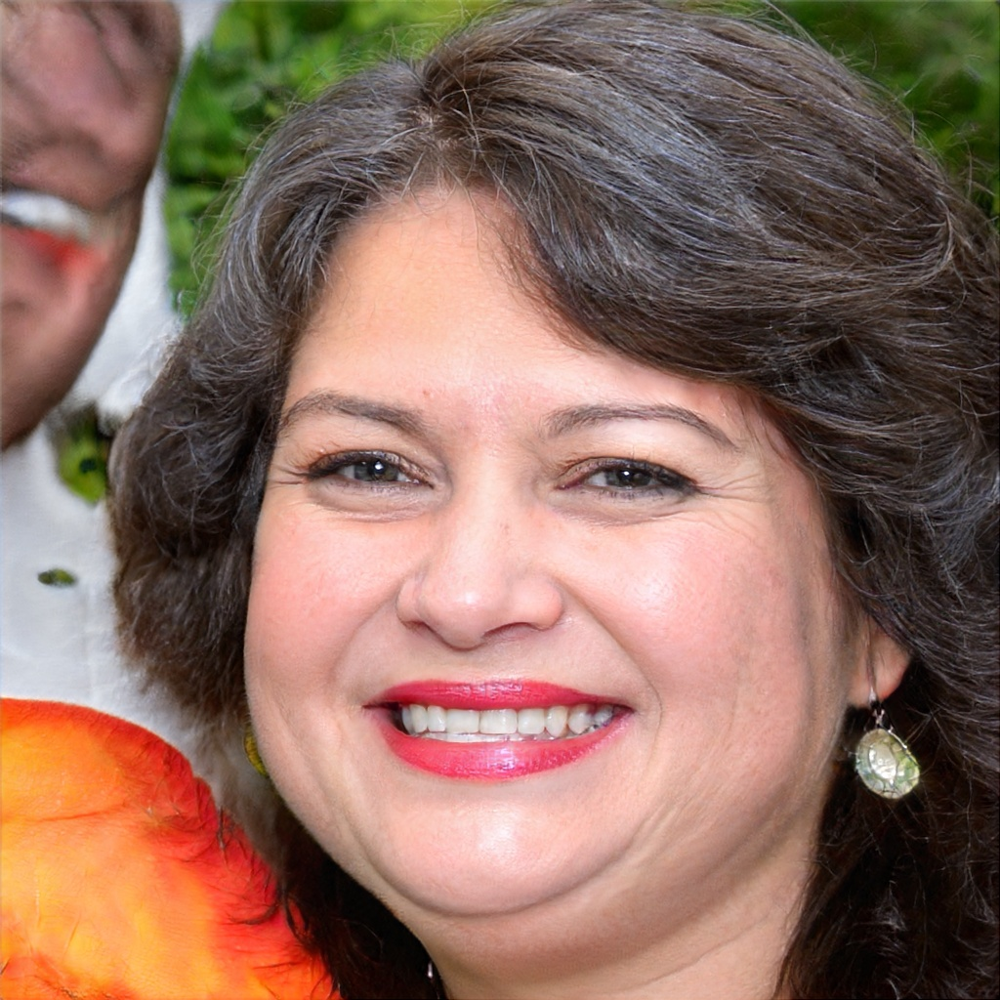
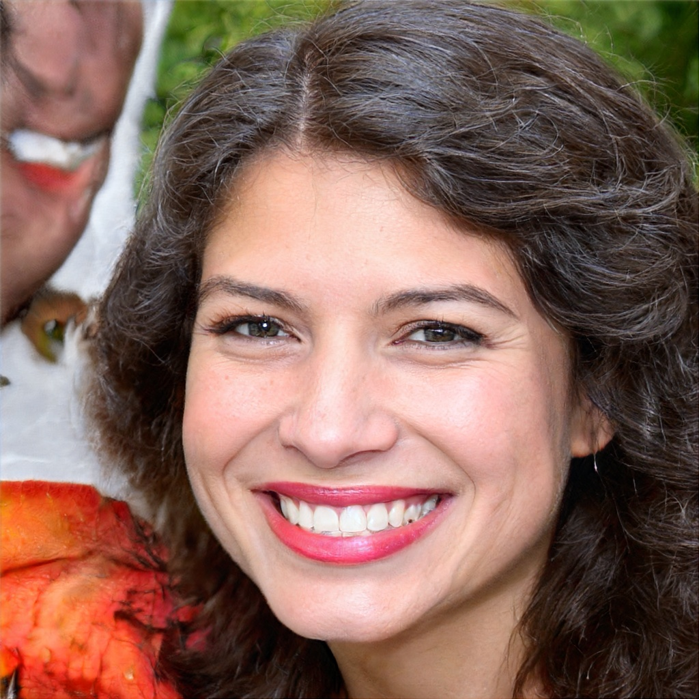
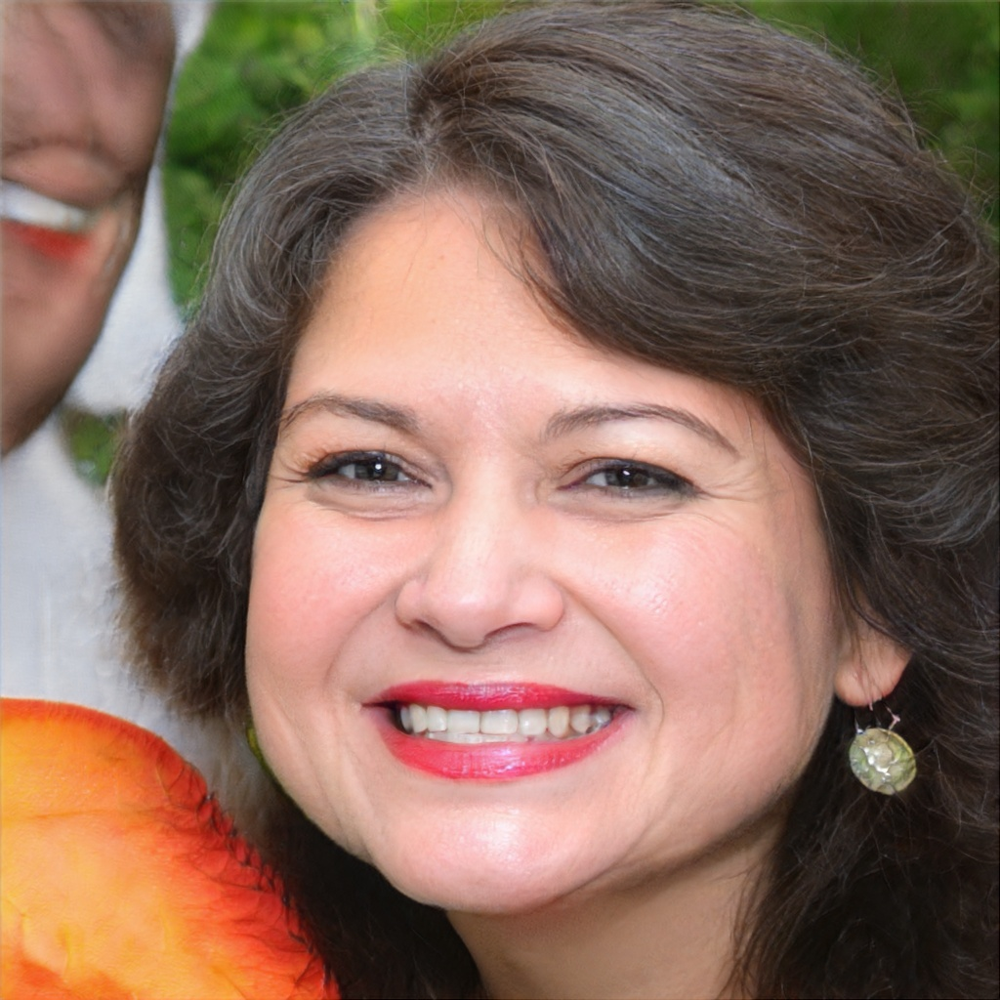

# Coarse-to-Fine: Facial Structure Editing of Portrait Images via Latent Space Classifications

## Dependencies


```
cuda 10.0
python 3.6
torch==1.2.0
torchvision==0.4.0
dlib
face-alignment==1.1.0
numpy==1.16.0
opencv-contrib-python==4.3.0.36
opencv-python==4.3.0.36
Pillow==5.4.1
tensorflow-gpu==1.14.0
```

## Dataset

[chin-editing Dataset](https://github.com/oneThousand1000/coarse-to-fine-chin-editing)

## Setup

Download the following pretrained models, put each of them to **PATH**:

|                                                              | PATH                                                         |
| ------------------------------------------------------------ | ------------------------------------------------------------ |
| [classification_model.pth](https://drive.google.com/drive/folders/1SQlYvN12JWPsPqXb-QKP7TgOzeGUax6R?usp=sharing) | ./classifier/classification                                  |
| [79999_iter.pth](https://drive.google.com/open?id=154JgKpzCPW82qINcVieuPH3fZ2e0P812) | ./classifier/src/feature_extractor/face_parsing_PyTorch/res/cp |
| [stylegan2-ffhq-config-f.pkl](https://nvlabs-fi-cdn.nvidia.com/stylegan2/networks/) | ./styleGAN2_Projector/stylegan2/model                        |
| [vgg16_zhang_perceptual.pkl](https://drive.google.com/drive/folders/1SQlYvN12JWPsPqXb-QKP7TgOzeGUax6R?usp=sharing) | ./styleGAN2_Projector/stylegan2/model                        |
| [Gs.pth](https://drive.google.com/drive/folders/1SQlYvN12JWPsPqXb-QKP7TgOzeGUax6R?usp=sharing) | ./styleGAN2_model/pretrain                                   |
| [vgg16.pth](https://drive.google.com/drive/folders/1SQlYvN12JWPsPqXb-QKP7TgOzeGUax6R?usp=sharing) | ./styleGAN2_model/pretrain                                   |

install 

```python
conda create -n Coarse2Fine python=3.6
activate Coarse2Fine
pip install -r requirements.txt
```

## How to Use

### separation boundaries

We provides boundaries in [./interface/boundaries](https://github.com/oneThousand1000/CHINGER-Removing-Double-Chin-from-Portraits/tree/main/interface/boundaries):

| dir                 | information                                                  |
| ------------------- | ------------------------------------------------------------ |
| ├ coarse            | **coarse** boundaries of StyleGAN2                           |
| │ ├ psi_0.5         | coarse boundaries trained from **psi-0.5** dataset           |
| │ └ psi_0.8         | coarse boundaries trained from **psi-0.8** dataset           |
| ├ fine              | **fine** boundaries of StyleGAN2                             |
| │ ├ psi_0.5         | fine boundaries trained from **psi-0.5** dataset             |
| │ ├ psi_0.8         | fine boundaries trained from **psi-0.8** dataset             |
| │ └ all             | fine boundaries trained from **overall** dataset             |
| └ StyleGAN_boundary | **coarse** boundaries of StyleGAN (can not be applied to StyleGAN2) |

Notice that **psi-0.5** dataset and **psi-0.8** dataset is images and latent codes we generated by stylegan2 with **psi=0.5(faces are more stable )** and **psi=0.8(faces are more diverse)**

### testing

We provide scripts to directly remove the double chin.

**data prepare :**

<u>For real images</u>, we recommend you use the projector of official **[ stylegan2 ](https://github.com/NVlabs/stylegan2)** to obtain the latent codes of real images. (Notice that we can only get the WP latent code of real images, therefore you need to use boundaries in **WP(W+)** latent space.)

Download the official checkpoint from https://nvlabs-fi-cdn.nvidia.com/stylegan2/networks/ , put the `stylegan2-ffhq-config-f.pkl` to `./styleGAN2_Projector/stylegan2/model` , download the vgg model from https://nvlabs-fi-cdn.nvidia.com/stylegan/networks/metrics/vgg16_zhang_perceptual.pkl,  put the `vgg16_zhang_perceptual.pkl` to `./styleGAN2_Projector/stylegan2/model`, then check compiler_bindir_search_path list in `./styleGAN2_Projector/stylegan2\dnnlib\tflib\custom_ops.py`

then run Projector(tensorflow version):

```python
cd styleGAN2_Projector
python real_img_project.py\
	project-real-images\
	--network=./stylegan2/model/stylegan2-ffhq-config-f.pkl\
    --dataset=ffhq\
    --data-dir=PATH_TO_REAL_IMGS\
	--save-dir=PATH_TO_SAVE_LATENT_CODE\
```

or Projector(pytorch version):

```python
cd styleGAN2_model/stylegan2_pytorch
python run_projector.py 
project_real_images\ 
--data_dir=PATH_TO_REAL_IMGS\ 
--num_images=4 \
--network=../pretrain/Gs.pth\
--output=PATH_TO_SAVE_LATENT_CODE
```

then put original images in `$PATH/origin`, named `{name}.jpg`, the corresponding wp latent code should be put in `$PATH/code`, named `{name}_wp.npy`. 

**run:**

Finally , for diffuse method (both coarse boundaries and  fine boundaries work):

```python
python main_diffuse.py\
--data_dir $PATH\
--boundary_path PATH_TO_LOAD_BOUNDARY\
--boundary_init_ratio -4.0\
--boundary_additional_ratio -1.0\
--latent_space_type WP\
--learning_rate 0.01\
--num_iterations 100\
--loss_weight_feat 1e-4\
```

for warp method (need fine boundaries):

```python
python main_warp.py\
--data_dir $PATH\
--boundary_path PATH_TO_LOAD_FINE_BOUNDARY\
--boundary_init_ratio -4.0\
--latent_space_type WP
```

### training

#### coarse separation boundary training

You can use the pre-trained boundaries in [./interface/boundaries](https://github.com/oneThousand1000/CHINGER-Removing-Double-Chin-from-Portraits/tree/main/interface/boundaries), or train your own boundary:

1. Data generate:

   ```python
   python generate_data_and_score.py\
   --output_dir PATH_TO_DATASET\
   --num 50000\
   --truncation_psi 0.8\
   ```


If you want to generate data from your own latent codes, please set `--latent_codes_path`  as`PATH_TO_LATENT_CODE`, else the latent codes will be randomly generated.

Notice that if `num` is more than the number of latent codes(NUM) in your input latent code file, we will randomly generate `num-NUM` latent codes for you.

If you only want to generate images that have double chin ,set `--double_chin_only`

​	2.Coarse boundary training:

```python
python train_coarse_boundary.py\
--output_dir PATH_TO_SAVE_BOUNDARY\
--latent_codes_path PATH_TO_LOAD_LATENT_CODE \
--scores_path PATH_TO_LOAD_SCORES\
--chosen_num_or_ratio 0.1\
--split_ratio 0.9 \
```

the boundary will be saved in `PATH_TO_SAVE_BOUNDARY`


#### fine separation boundary training

We assume you put your data to path **'DATA'** in this section 

We provide the whole diffusion process step by step :

First, prepare the data for diffusion

1.**using coarse boundary to prepare data**

```python
python remove_double_chin_step1.py\
--output_dir DATA\
--boundary_path PATH_TO_LOAD_BOUNDARY\
--ratio -4\
--latent_space_type WP\
--num 10000\
--truncation_psi 0.8\
```

For generate data from given latent code, please set

 `--input_latent_codes_path PATH_TO_LATENT_CODE`.

Notice that if `num` is more than the number of latent codes(NUM) in your input latent code file, we will randomly generate `num-NUM` latent codes for you.

<figure class="half">           </figure>

then **diffuse the prepared data**:

```python
python remove_double_chin_step2.py\
--data_dir DATA\
--latent_space_type WP\
--learning_rate 0.01\
--num_iterations 100\
--loss_weight_feat 5e-5\
--truncation_psi 0.8\
```

the `data_dir` should be the same as `output_dir` that you input in remove_double_chin_step1.py

<figure class="half">      </figure>

the results of diffusion will be saved in  `data_dir` 

3.After diffuse, you can use the results of diffuse to **train a fine boundary**:

```python
python train_fine_boundary.py\
--output_dir PATH_TO_SAVE_BOUNDARY\
--latent_codes_path $DATA/codes \
--scores_path PATH_TO_LOAD_SCORES\
--chosen_num_or_ratio 0.1\
--split_ratio 0.9 \
```

the fine boundary has better performance in preserving face identity.

the comparison between  fine boundary(right) and coarse boundary(middle):


## Contact

onethousand@zju.edu.cn

## Citation

If you use this code for your research, please cite our paper:

```
@article{DBLP:journals/tog/WuYX021,
  author    = {Yiqian Wu and
               Yong{-}Liang Yang and
               Qinjie Xiao and
               Xiaogang Jin},
  title     = {Coarse-to-fine: facial structure editing of portrait images via latent
               space classifications},
  journal   = {{ACM} Trans. Graph.},
  volume    = {40},
  number    = {4},
  pages     = {46:1--46:13},
  year      = {2021}
}
```


## Reference and Acknowledgements

We thanks the following works:

[StyleGAN2](https://github.com/NVlabs/stylegan2)

[InterFaceGAN](https://github.com/genforce/interfacegan)

[StyleGAN2(pytorch-version)](https://github.com/Tetratrio/stylegan2_pytorch)

[face-alignment](https://github.com/1adrianb/face-alignment)

[idinvert](https://github.com/genforce/idinvert)

[MaskGAN](https://github.com/switchablenorms/CelebAMask-HQ)

```
@inproceedings{zhu2020indomain,
  title     = {In-domain GAN Inversion for Real Image Editing},
  author    = {Zhu, Jiapeng and Shen, Yujun and Zhao, Deli and Zhou, Bolei},
  booktitle = {Proceedings of European Conference on Computer Vision (ECCV)},
  year      = {2020}
}
@inproceedings{bulat2017far,
  title={How far are we from solving the 2D \& 3D Face Alignment problem? (and a dataset of 230,000 3D facial landmarks)},
  author={Bulat, Adrian and Tzimiropoulos, Georgios},
  booktitle={International Conference on Computer Vision},
  year={2017}
}
@inproceedings{shen2020interpreting,
  title     = {Interpreting the Latent Space of GANs for Semantic Face Editing},
  author    = {Shen, Yujun and Gu, Jinjin and Tang, Xiaoou and Zhou, Bolei},
  booktitle = {CVPR},
  year      = {2020}
}
@inproceedings{Karras2019stylegan2,
  title     = {Analyzing and Improving the Image Quality of {StyleGAN}},
  author    = {Tero Karras and Samuli Laine and Miika Aittala and Janne Hellsten and Jaakko Lehtinen and Timo Aila},
  booktitle = {Proc. CVPR},
  year      = {2020}
}
@inproceedings{CelebAMask-HQ,
  title={MaskGAN: Towards Diverse and Interactive Facial Image Manipulation},
  author={Lee, Cheng-Han and Liu, Ziwei and Wu, Lingyun and Luo, Ping},
  booktitle={IEEE Conference on Computer Vision and Pattern Recognition (CVPR)},
  year={2020}
}
```

