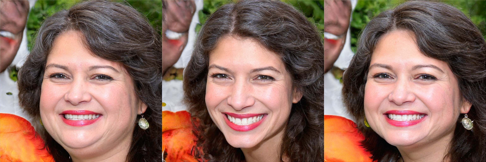

# Coarse-to-Fine: Facial Structure Editing of Portrait Images via Latent Space Classifications

Published in *ACM Transactions on Graphics (Proc. of Siggraph 2021), 40(4): Article 46.*, 2021

[Yiqian Wu](https://onethousandwu.com/), [Yongliang Yang](https://www.yongliangyang.net/), Qinjie Xiao, [Xiaogang Jin](http://www.cad.zju.edu.cn/home/jin/).

[Paper](http://www.cad.zju.edu.cn/home/jin/sig2021/paper46.pdf)    [Video](http://www.cad.zju.edu.cn/home/jin/sig2021/demo.mp4)    [Project Page](http://www.cad.zju.edu.cn/home/jin/sig2021/sig2021.htm)

**Abstract:**

Facial structure editing of portrait images is challenging given the facial variety, the lack of ground-truth, the necessity of jointly adjusting color and shape, and the requirement of no visual artifacts. In this paper, we investigate how to perform chin editing as a case study of editing facial structures. We present a novel method that can automatically remove the double chin effect in portrait images. Our core idea is to train a fine classification boundary in the latent space of the portrait images. This can be used to edit the chin appearance by manipulating the latent code of the input portrait image while preserving the original portrait features. To achieve such a fine separation boundary, we employ a carefully designed training stage based on latent codes of paired synthetic images with and without a double chin. In the testing stage, our method can automatically handle portrait images with only a refinement to subtle misalignment before and after double chin editing. Our model enables alteration to the neck region of the input portrait image while keeping other regions unchanged, and guarantees the rationality of neck structure and the consistency of facial characteristics. To the best of our knowledge, this presents the first effort towards an effective application for editing double chins. We validate the efficacy and efficiency of our approach through extensive experiments and user studies.

## Requirements

1. Windows 
2. Python 3.6
3. NVIDIA GPU + CUDA10.0 + CuDNN

## Installation

Download the following pretrained models, put each of them to **PATH**:

|                                                              | PATH                                                         |
| ------------------------------------------------------------ | ------------------------------------------------------------ |
| [classification_model.pth](https://drive.google.com/drive/folders/1SQlYvN12JWPsPqXb-QKP7TgOzeGUax6R?usp=sharing) | ./classifier/double_chin_classification                      |
| [79999_iter.pth](https://drive.google.com/open?id=154JgKpzCPW82qINcVieuPH3fZ2e0P812) | ./classifier/src/feature_extractor/face_parsing_PyTorch/res/cp |
| [Gs.pth](https://drive.google.com/drive/folders/1SQlYvN12JWPsPqXb-QKP7TgOzeGUax6R?usp=sharing) | ./styleGAN2_model/pretrain                                   |
| [vgg16.pth](https://drive.google.com/drive/folders/1SQlYvN12JWPsPqXb-QKP7TgOzeGUax6R?usp=sharing) | ./styleGAN2_model/pretrain                                   |
| [shape_predictor_68_face_landmarks.dat.bz2](http://dlib.net/files/shape_predictor_68_face_landmarks.dat.bz2) | ./models                                                     |

Please install dependencies by

```python
conda create -n Coarse2Fine python=3.6
activate Coarse2Fine
pip install -r requirements.txt
```

## How to Use

### Pre-trained separation boundaries

Pre-trained separation boundaries can be found at [./interface/boundaries](https://github.com/oneThousand1000/CHINGER-Removing-Double-Chin-from-Portraits/tree/main/interface/boundaries):

| dir                 | information                                                  |
| ------------------- | ------------------------------------------------------------ |
| ├ coarse            | **coarse** separation boundaries of StyleGAN2                |
| │ ├ psi_0.5         | coarse separation boundaries trained from **psi-0.5** dataset |
| │ └ psi_0.8         | coarse separation boundaries trained from **psi-0.8** dataset |
| ├ fine              | **fine** separation boundaries of StyleGAN2                  |
| │ ├ psi_0.5         | fine separation boundaries trained from **psi-0.5** dataset  |
| │ ├ psi_0.8         | fine separation boundaries trained from **psi-0.8** dataset  |
| │ └ all             | fine separation boundaries trained from **overall** dataset  |
| └ StyleGAN_boundary | **coarse** separation boundaries of StyleGAN                 |

Notice that **psi-0.5** dataset and **psi-0.8** dataset is images and latent codes we generated by stylegan2 with **psi=0.5(faces are more stable )** and **psi=0.8(faces are more diverse)**

### Testing

#### data prepare :

<u>For **real images**</u>, first find the matching latent vectors.

First, [Align faces from input images](https://github.com/pbaylies/stylegan-encoder/blob/master/align_images.py) and save aligned images to $DATA_PATH$/origin.

```python
python align_images.py\
	--raw_dir $DATA_PATH$/raw\
    --aligned_dir $DATA_PATH$/origin
```

For **aligned images** original image `{name}.jpg`  that placed in`$DATA_PATH$/origin`, the corresponding **latent code** (in WP(W+) latent space) `{name}_wp.npy` should be placed in `$DATA_PATH$/code`. 

We recommend you use the projector of official **[ stylegan2 ](https://github.com/NVlabs/stylegan2)** to obtain the latent codes of real images, to correctly use the StyleGAN2 [projector](https://github.com/NVlabs/stylegan2/blob/master/run_projector.py), please follow the **Requirements** in [ stylegan2 ](https://github.com/NVlabs/stylegan2). 

#### Run

For diffuse method (both coarse separation boundaries and  fine separation boundaries work):

```python
python main_diffuse.py\
    --data_dir $DATA_PATH$\
    --boundary_path ./interface/boundaries/fine/all\
    --boundary_init_ratio -4.0\
    --boundary_additional_ratio -1.0\
    --latent_space_type WP
```

For warp method (need fine separation boundaries):

```python
python main_warp.py\
    --data_dir $DATA_PATH$\
    --boundary_path ./interface/boundaries/fine/all\
    --boundary_init_ratio -4.0\
    --latent_space_type WP
```

### Training

#### coarse separation boundary training

1. Data generation:

   ```python
   python generate_data_and_score.py\
   --output_dir $PATH_TO_DATASET$\
   --num 50000\
   --truncation_psi 0.8\
   ```


If you want to generate data from your own latent codes, please set `--latent_codes_path`  as `PATH_TO_LATENT_CODE`, else the latent codes will be randomly generated.

If you only want to generate images that have double chin ,set `--double_chin_only`

​	2.Coarse boundary training:

```python
python train_coarse_boundary.py\
--output_dir PATH_TO_SAVE_BOUNDARY\
--latent_codes_path $PATH_TO_DATASET$/w.npy \
--scores_path $PATH_TO_DATASET$/double_chin_scores.npy\
--chosen_num_or_ratio 0.1\
--split_ratio 0.9 \
```

The boundary will be saved in `PATH_TO_SAVE_BOUNDARY`

#### fine separation boundary training

First, prepare the data for diffusion

**using coarse boundary to prepare data**

```python
python remove_double_chin_step1.py\
    --output_dir $TRAINING_DIR$\
    --boundary_path PATH_TO_LOAD_BOUNDARY\   
    --input_data_dir $PATH_TO_DATASET$
```

Then **diffuse the prepared data**:

```python
python remove_double_chin_step2.py\
	--data_dir $TRAINING_DIR$
```

The `data_dir` should be the same as `output_dir` that you input in remove_double_chin_step1.py, results of diffusion will be saved in  `data_dir`.

After diffuse, you can use the results of diffuse to **train a fine boundary**:

```python
python train_fine_boundary.py\
--output_dir PATH_TO_SAVE_BOUNDARY\
--latent_codes_path $TRAINING_DIR$/codes\
--split_ratio 0.9 \
```

The comparison between fine boundary(right) and coarse boundary(middle):




## Contact

onethousand@zju.edu.cn / [onethousand1250@gmail.com](mailto:onethousand1250@gmail.com)

## License and Citation

You can **use, redistribute, and adapt this software for non-commercial purposes only**.

If you use this code for your research, please cite our paper:

```
@article{DBLP:journals/tog/WuYX021,
  author    = {Yiqian Wu and
               Yong{-}Liang Yang and
               Qinjie Xiao and
               Xiaogang Jin},
  title     = {Coarse-to-fine: facial structure editing of portrait images via latent
               space classifications},
  journal   = {{ACM} Trans. Graph.},
  volume    = {40},
  number    = {4},
  pages     = {46:1--46:13},
  year      = {2021}
}
```


## Reference and Acknowledgements

We thanks the following works:

[StyleGAN2](https://github.com/NVlabs/stylegan2)

[InterFaceGAN](https://github.com/genforce/interfacegan)

[StyleGAN2(pytorch-version)](https://github.com/Tetratrio/stylegan2_pytorch)

[face-alignment](https://github.com/1adrianb/face-alignment)

[idinvert](https://github.com/genforce/idinvert)

[MaskGAN](https://github.com/switchablenorms/CelebAMask-HQ)

```
@inproceedings{zhu2020indomain,
  title     = {In-domain GAN Inversion for Real Image Editing},
  author    = {Zhu, Jiapeng and Shen, Yujun and Zhao, Deli and Zhou, Bolei},
  booktitle = {Proceedings of European Conference on Computer Vision (ECCV)},
  year      = {2020}
}
@inproceedings{bulat2017far,
  title={How far are we from solving the 2D \& 3D Face Alignment problem? (and a dataset of 230,000 3D facial landmarks)},
  author={Bulat, Adrian and Tzimiropoulos, Georgios},
  booktitle={International Conference on Computer Vision},
  year={2017}
}
@inproceedings{shen2020interpreting,
  title     = {Interpreting the Latent Space of GANs for Semantic Face Editing},
  author    = {Shen, Yujun and Gu, Jinjin and Tang, Xiaoou and Zhou, Bolei},
  booktitle = {CVPR},
  year      = {2020}
}
@inproceedings{Karras2019stylegan2,
  title     = {Analyzing and Improving the Image Quality of {StyleGAN}},
  author    = {Tero Karras and Samuli Laine and Miika Aittala and Janne Hellsten and Jaakko Lehtinen and Timo Aila},
  booktitle = {Proc. CVPR},
  year      = {2020}
}
@inproceedings{CelebAMask-HQ,
  title={MaskGAN: Towards Diverse and Interactive Facial Image Manipulation},
  author={Lee, Cheng-Han and Liu, Ziwei and Wu, Lingyun and Luo, Ping},
  booktitle={IEEE Conference on Computer Vision and Pattern Recognition (CVPR)},
  year={2020}
}
```

